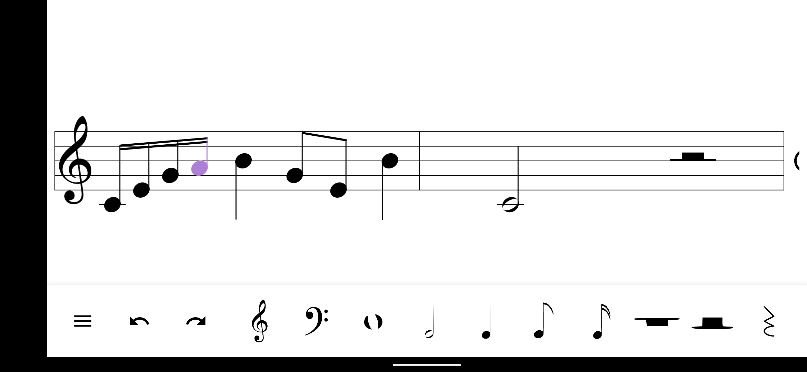

# composing-app

An Android app for composing music on your phone!

## Current functionality

This app is incomplete, but the codebase is large and many features have already been developed, including:
* Adding measures to a score and scrolling through it
* Changing the score's clef
* Adding notes and rests
  * Currently supported notelengths are sixteenth, eighth, quarter, half, and whole notes respectively
* Undo/Redo of certain actions, such as changing the score's clef 

Checkout my [website](https://personal-website-70fad.web.app/) to see a video demonstration of the app!

## Contact
Interested in the project? Got a feature you would like to see in the app? 
[Email me](mailto:k.manku4@gmail.com) - let's chat!
